# Core "Rating" Definition & Classification
**Section:** Rating
**Subsection:** Core "Rating" Definition & Classification

## Diagram

```mermaid
erDiagram
  %%=== Layer 1: Core Rating & Classification ===%%
  RATING {
    UUID id PK                         "NOT NULL; UNIQUE"
    UUID user_id FK                    "NOT NULL; references USER.id"
    SMALLINT rating_value              "NOT NULL; CHECK (rating_value >= 1 AND rating_value <= 5)"
    TEXT review_text                   "NULLABLE; optional written review"
    BOOLEAN is_verified                "NOT NULL; DEFAULT false; user actually used the resource"
    BOOLEAN is_featured                "NOT NULL; DEFAULT false; highlighted by admins"
    UUID rating_status_id FK           "NOT NULL; references RATING_STATUS.id"
    UUID created_by FK                 "NOT NULL; references USER.id"
    UUID updated_by FK                 "NULLABLE; references USER.id"
    TIMESTAMP created_at               "NOT NULL; DEFAULT now()"
    TIMESTAMP updated_at               "NOT NULL; DEFAULT now()"
    BOOLEAN is_active                  "NOT NULL; DEFAULT true"
    UUID visibility_id FK              "NOT NULL; references VISIBILITY.id"
  }
  
  %%— Resource-specific rating relationships —
  RATING_WORKOUT {
    UUID rating_id PK,FK               "NOT NULL; references RATING.id"
    UUID workout_id PK,FK              "NOT NULL; references WORKOUT.id"
    UUID created_by FK                 "NOT NULL; references USER.id"
    UUID updated_by FK                 "NULLABLE; references USER.id"
    TIMESTAMP created_at               "NOT NULL; DEFAULT now()"
    TIMESTAMP updated_at               "NOT NULL; DEFAULT now()"
    BOOLEAN is_active                  "NOT NULL; DEFAULT true"
  }
  
  RATING_EXERCISE {
    UUID rating_id PK,FK               "NOT NULL; references RATING.id"
    UUID exercise_id PK,FK             "NOT NULL; references EXERCISE.id"
    UUID created_by FK                 "NOT NULL; references USER.id"
    UUID updated_by FK                 "NULLABLE; references USER.id"
    TIMESTAMP created_at               "NOT NULL; DEFAULT now()"
    TIMESTAMP updated_at               "NOT NULL; DEFAULT now()"
    BOOLEAN is_active                  "NOT NULL; DEFAULT true"
  }
  
  RATING_PROGRAM {
    UUID rating_id PK,FK               "NOT NULL; references RATING.id"
    UUID program_id PK,FK              "NOT NULL; references PROGRAM.id"
    UUID created_by FK                 "NOT NULL; references USER.id"
    UUID updated_by FK                 "NULLABLE; references USER.id"
    TIMESTAMP created_at               "NOT NULL; DEFAULT now()"
    TIMESTAMP updated_at               "NOT NULL; DEFAULT now()"
    BOOLEAN is_active                  "NOT NULL; DEFAULT true"
  }
  
  RATING_EQUIPMENT {
    UUID rating_id PK,FK               "NOT NULL; references RATING.id"
    UUID equipment_id PK,FK            "NOT NULL; references EQUIPMENT.id"
    UUID created_by FK                 "NOT NULL; references USER.id"
    UUID updated_by FK                 "NULLABLE; references USER.id"
    TIMESTAMP created_at               "NOT NULL; DEFAULT now()"
    TIMESTAMP updated_at               "NOT NULL; DEFAULT now()"
    BOOLEAN is_active                  "NOT NULL; DEFAULT true"
  }
  
  %%— Status and Classification —
  RATING_STATUS {
    UUID id PK                         "NOT NULL; UNIQUE"
    ENUM name                          "NOT NULL; UNIQUE; PENDING, APPROVED, REJECTED, FLAGGED"
    TEXT description                   "NULLABLE"
  }
  
  RATING_CATEGORY {
    UUID rating_id PK,FK               "NOT NULL; references RATING.id"
    UUID category_id PK,FK             "NOT NULL; references CATEGORY.id"
    UUID created_by FK                 "NOT NULL; references USER.id"
    UUID updated_by FK                 "NULLABLE; references USER.id"
    TIMESTAMP created_at               "NOT NULL; DEFAULT now()"
    TIMESTAMP updated_at               "NOT NULL; DEFAULT now()"
    BOOLEAN is_active                  "NOT NULL; DEFAULT true"
  }
  
  RATING_TAG {
    UUID rating_id PK,FK               "NOT NULL; references RATING.id"
    UUID tag_id PK,FK                  "NOT NULL; references TAG.id"
    UUID created_by FK                 "NOT NULL; references USER.id"
    UUID updated_by FK                 "NULLABLE; references USER.id"
    TIMESTAMP created_at               "NOT NULL; DEFAULT now()"
    TIMESTAMP updated_at               "NOT NULL; DEFAULT now()"
    BOOLEAN is_active                  "NOT NULL; DEFAULT true"
  }
  
  %%— Relationships —
  USER ||--o{ RATING                  : "creates ratings"
  RATING ||--|| RATING_STATUS         : "status lookup"
  RATING ||--o{ RATING_WORKOUT        : "workout ratings"
  RATING ||--o{ RATING_EXERCISE       : "exercise ratings"
  RATING ||--o{ RATING_PROGRAM        : "program ratings"
  RATING ||--o{ RATING_EQUIPMENT      : "equipment ratings"
  RATING ||--o{ RATING_CATEGORY       : "categorized by"
  RATING ||--o{ RATING_TAG            : "tagged with"
  RATING_WORKOUT }|--|| WORKOUT       : "workout lookup"
  RATING_EXERCISE }|--|| EXERCISE     : "exercise lookup"
  RATING_PROGRAM }|--|| PROGRAM       : "program lookup"
  RATING_EQUIPMENT }|--|| EQUIPMENT   : "equipment lookup"
  RATING_CATEGORY }|--|| CATEGORY     : "category lookup"
  RATING_TAG }|--|| TAG               : "tag lookup"
```

## Notes
This diagram represents the core "rating" definition & classification structure and relationships within the rating domain.

---
*Generated from diagram extraction script*