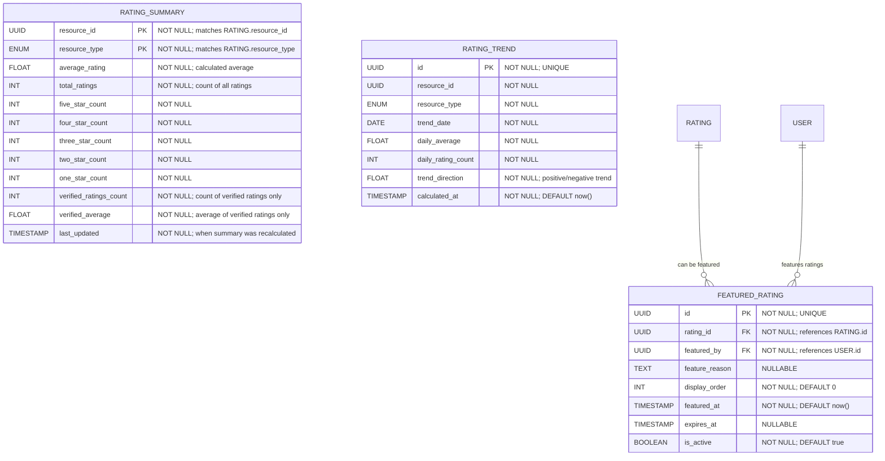

# Rating Analytics & Aggregation

**Section:** Rating
**Subsection:** Rating Analytics & Aggregation

## Diagram

## Notes

This diagram represents the rating analytics & aggregation structure and relationships within the rating domain.

---
*Generated from diagram extraction script*
