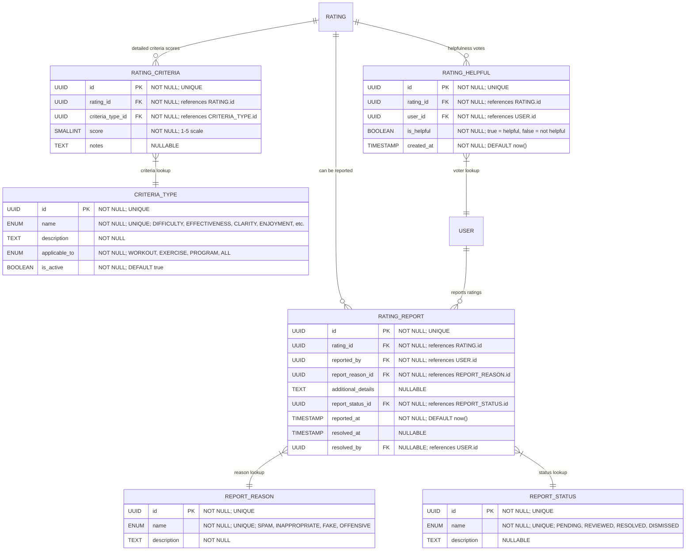

# Rating Criteria & Interactions

**Section:** Rating
**Subsection:** Rating Criteria & Interactions

## Diagram

## Notes

This diagram represents the rating criteria & interactions structure and relationships within the rating domain.

---
*Generated from diagram extraction script*
