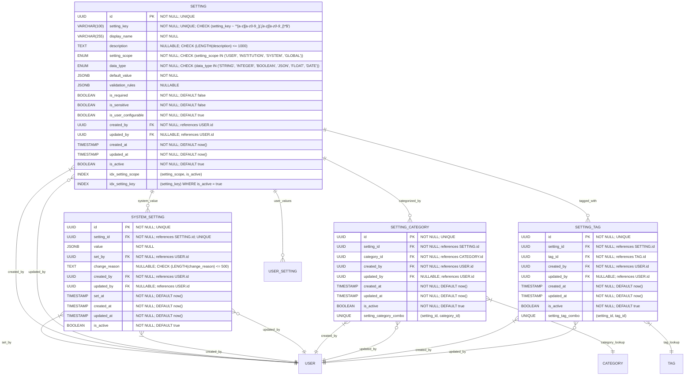

# Settings Management
**Domain:** Settings
**Layer:** Core

```mermaid
erDiagram
  SETTING {
    UUID id PK                        "NOT NULL; UNIQUE"
    VARCHAR(100) setting_key          "NOT NULL; UNIQUE; CHECK (setting_key ~ '^[a-z][a-z0-9_]*(\.[a-z][a-z0-9_]*)*$')"
    VARCHAR(255) display_name         "NOT NULL"
    TEXT description                  "NULLABLE; CHECK (LENGTH(description) <= 1000)"
    ENUM setting_scope                "NOT NULL; CHECK (setting_scope IN ('USER', 'INSTITUTION', 'SYSTEM', 'GLOBAL'))"
    ENUM data_type                    "NOT NULL; CHECK (data_type IN ('STRING', 'INTEGER', 'BOOLEAN', 'JSON', 'FLOAT', 'DATE'))"
    JSONB default_value               "NOT NULL"
    JSONB validation_rules            "NULLABLE"
    BOOLEAN is_required               "NOT NULL; DEFAULT false"
    BOOLEAN is_sensitive              "NOT NULL; DEFAULT false"
    BOOLEAN is_user_configurable      "NOT NULL; DEFAULT true"
    UUID created_by FK                "NOT NULL; references USER.id"
    UUID updated_by FK                "NULLABLE; references USER.id"
    TIMESTAMP created_at              "NOT NULL; DEFAULT now()"
    TIMESTAMP updated_at              "NOT NULL; DEFAULT now()"
    BOOLEAN is_active                 "NOT NULL; DEFAULT true"
    INDEX idx_setting_scope           "(setting_scope, is_active)"
    INDEX idx_setting_key             "(setting_key) WHERE is_active = true"
  }
  
  SYSTEM_SETTING {
    UUID id PK                        "NOT NULL; UNIQUE"
    UUID setting_id FK                "NOT NULL; references SETTING.id; UNIQUE"
    JSONB value                       "NOT NULL"
    UUID set_by FK                    "NOT NULL; references USER.id"
    TEXT change_reason                "NULLABLE; CHECK (LENGTH(change_reason) <= 500)"
    UUID created_by FK                "NOT NULL; references USER.id"
    UUID updated_by FK                "NULLABLE; references USER.id"
    TIMESTAMP set_at                  "NOT NULL; DEFAULT now()"
    TIMESTAMP created_at              "NOT NULL; DEFAULT now()"
    TIMESTAMP updated_at              "NOT NULL; DEFAULT now()"
    BOOLEAN is_active                 "NOT NULL; DEFAULT true"
  }
  
  SETTING_CATEGORY {
    UUID id PK                        "NOT NULL; UNIQUE"
    UUID setting_id FK                "NOT NULL; references SETTING.id"
    UUID category_id FK               "NOT NULL; references CATEGORY.id"
    UUID created_by FK                "NOT NULL; references USER.id"
    UUID updated_by FK                "NULLABLE; references USER.id"
    TIMESTAMP created_at              "NOT NULL; DEFAULT now()"
    TIMESTAMP updated_at              "NOT NULL; DEFAULT now()"
    BOOLEAN is_active                 "NOT NULL; DEFAULT true"
    UNIQUE setting_category_combo     "(setting_id, category_id)"
  }
  
  SETTING_TAG {
    UUID id PK                        "NOT NULL; UNIQUE"
    UUID setting_id FK                "NOT NULL; references SETTING.id"
    UUID tag_id FK                    "NOT NULL; references TAG.id"
    UUID created_by FK                "NOT NULL; references USER.id"
    UUID updated_by FK                "NULLABLE; references USER.id"
    TIMESTAMP created_at              "NOT NULL; DEFAULT now()"
    TIMESTAMP updated_at              "NOT NULL; DEFAULT now()"
    BOOLEAN is_active                 "NOT NULL; DEFAULT true"
    UNIQUE setting_tag_combo          "(setting_id, tag_id)"
  }

  SETTING ||--o{ SYSTEM_SETTING : "system_value"
  SETTING ||--o{ USER_SETTING : "user_values"
  SETTING ||--o{ SETTING_CATEGORY : "categorized_by"
  SETTING ||--o{ SETTING_TAG : "tagged_with"
  SETTING_CATEGORY }|--|| CATEGORY : "category_lookup"
  SETTING_TAG }|--|| TAG : "tag_lookup"
  SYSTEM_SETTING }|--|| USER : "set_by"
  SETTING }|--|| USER : "created_by"
  SETTING }o--|| USER : "updated_by"
  SYSTEM_SETTING }|--|| USER : "created_by"
  SYSTEM_SETTING }o--|| USER : "updated_by"
  SETTING_CATEGORY }|--|| USER : "created_by"
  SETTING_CATEGORY }o--|| USER : "updated_by"
  SETTING_TAG }|--|| USER : "created_by"
  SETTING_TAG }o--|| USER : "updated_by"
```