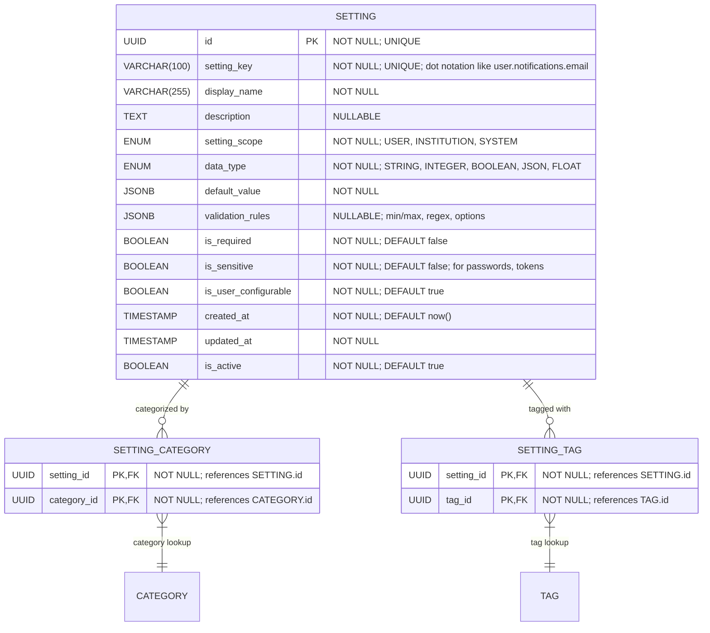

# Core "Settings" Definition & Classification

**Section:** Settings
**Subsection:** Core "Settings" Definition & Classification

## Diagram

## Notes

This diagram represents the core "settings" definition & classification structure and relationships within the settings domain.

---
*Generated from diagram extraction script*
