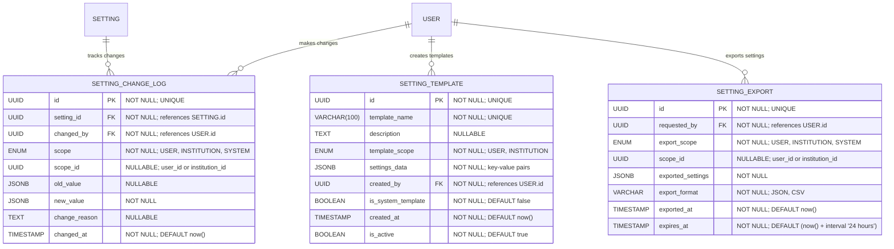

# Setting History & Validation

**Section:** Settings
**Subsection:** Setting History & Validation

## Diagram

## Notes

This diagram represents the setting history & validation structure and relationships within the settings domain.

---
*Generated from diagram extraction script*
