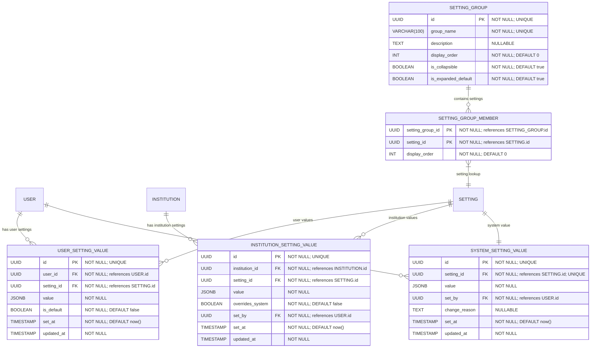

# Setting Values & Overrides

**Section:** Settings
**Subsection:** Setting Values & Overrides

## Diagram

## Notes

This diagram represents the setting values & overrides structure and relationships within the settings domain.

---
*Generated from diagram extraction script*
