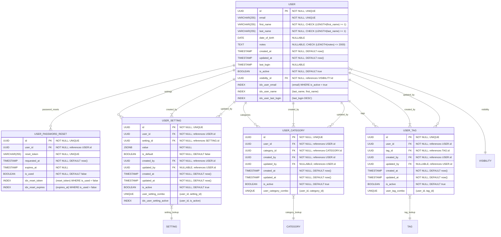

# User Core Identity
**Domain:** User
**Layer:** Core

```mermaid
erDiagram
  USER {
    UUID id PK                        "NOT NULL; UNIQUE"
    VARCHAR(255) email                "NOT NULL; UNIQUE"
    VARCHAR(255) first_name           "NOT NULL; CHECK (LENGTH(first_name) >= 1)"
    VARCHAR(255) last_name            "NOT NULL; CHECK (LENGTH(last_name) >= 1)"
    DATE date_of_birth                "NULLABLE"
    TEXT notes                        "NULLABLE; CHECK (LENGTH(notes) <= 2000)"
    TIMESTAMP created_at              "NOT NULL; DEFAULT now()"
    TIMESTAMP updated_at              "NOT NULL; DEFAULT now()"
    TIMESTAMP last_login              "NULLABLE"
    BOOLEAN is_active                 "NOT NULL; DEFAULT true"
    UUID visibility_id FK             "NOT NULL; references VISIBILITY.id"
    INDEX idx_user_email              "(email) WHERE is_active = true"
    INDEX idx_user_name               "(last_name, first_name)"
    INDEX idx_user_last_login         "(last_login DESC)"
  }
  
  USER_PASSWORD_RESET {
    UUID id PK                        "NOT NULL; UNIQUE"
    UUID user_id FK                   "NOT NULL; references USER.id"
    VARCHAR(255) reset_token          "NOT NULL; UNIQUE"
    TIMESTAMP requested_at            "NOT NULL; DEFAULT now()"
    TIMESTAMP expires_at              "NOT NULL"
    BOOLEAN is_used                   "NOT NULL; DEFAULT false"
    INDEX idx_reset_token             "(reset_token) WHERE is_used = false"
    INDEX idx_reset_expires           "(expires_at) WHERE is_used = false"
  }
  
  USER_SETTING {
    UUID id PK                        "NOT NULL; UNIQUE"
    UUID user_id FK                   "NOT NULL; references USER.id"
    UUID setting_id FK                "NOT NULL; references SETTING.id"
    JSONB value                       "NOT NULL"
    BOOLEAN is_default                "NOT NULL; DEFAULT false"
    UUID created_by FK                "NOT NULL; references USER.id"
    UUID updated_by FK                "NULLABLE; references USER.id"
    TIMESTAMP created_at              "NOT NULL; DEFAULT now()"
    TIMESTAMP updated_at              "NOT NULL; DEFAULT now()"
    BOOLEAN is_active                 "NOT NULL; DEFAULT true"
    UNIQUE user_setting_combo         "(user_id, setting_id)"
    INDEX idx_user_setting_active     "(user_id, is_active)"
  }
  
  USER_CATEGORY {
    UUID id PK                        "NOT NULL; UNIQUE"
    UUID user_id FK                   "NOT NULL; references USER.id"
    UUID category_id FK               "NOT NULL; references CATEGORY.id"
    UUID created_by FK                "NOT NULL; references USER.id"
    UUID updated_by FK                "NULLABLE; references USER.id"
    TIMESTAMP created_at              "NOT NULL; DEFAULT now()"
    TIMESTAMP updated_at              "NOT NULL; DEFAULT now()"
    BOOLEAN is_active                 "NOT NULL; DEFAULT true"
    UNIQUE user_category_combo        "(user_id, category_id)"
  }
  
  USER_TAG {
    UUID id PK                        "NOT NULL; UNIQUE"
    UUID user_id FK                   "NOT NULL; references USER.id"
    UUID tag_id FK                    "NOT NULL; references TAG.id"
    UUID created_by FK                "NOT NULL; references USER.id"
    UUID updated_by FK                "NULLABLE; references USER.id"
    TIMESTAMP created_at              "NOT NULL; DEFAULT now()"
    TIMESTAMP updated_at              "NOT NULL; DEFAULT now()"
    BOOLEAN is_active                 "NOT NULL; DEFAULT true"
    UNIQUE user_tag_combo             "(user_id, tag_id)"
  }

  USER ||--o{ USER_PASSWORD_RESET : "password_resets"
  USER ||--o{ USER_SETTING : "settings"
  USER ||--o{ USER_CATEGORY : "categories"
  USER ||--o{ USER_TAG : "tags"
  USER }|--|| VISIBILITY : "visibility"
  USER_SETTING }|--|| SETTING : "setting_lookup"
  USER_CATEGORY }|--|| CATEGORY : "category_lookup"
  USER_TAG }|--|| TAG : "tag_lookup"
  USER_SETTING }|--|| USER : "created_by"
  USER_SETTING }o--|| USER : "updated_by"
  USER_CATEGORY }|--|| USER : "created_by"
  USER_CATEGORY }o--|| USER : "updated_by"
  USER_TAG }|--|| USER : "created_by"
  USER_TAG }o--|| USER : "updated_by"
```

