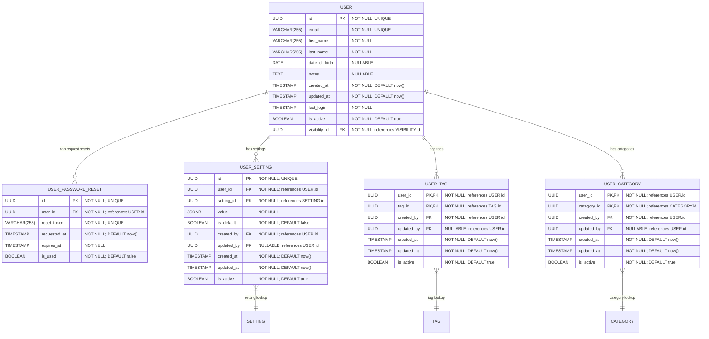

# Core "User" and Identity
**Section:** User
**Subsection:** Core "User" and Identity

## Diagram

## Notes
This diagram represents the core "user" and identity structure and relationships within the user domain.

---
*Generated from diagram extraction script*
