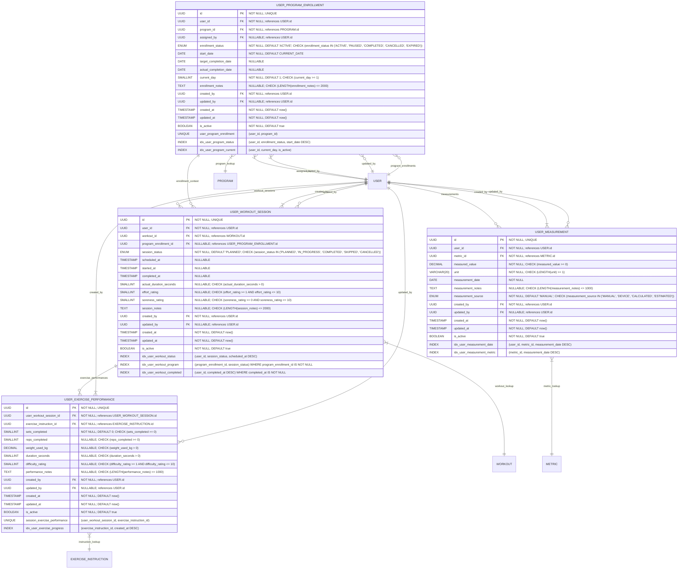

# User Progress & Ownership
**Domain:** User
**Layer:** Progress

```mermaid
erDiagram
  USER_PROGRAM_ENROLLMENT {
    UUID id PK                        "NOT NULL; UNIQUE"
    UUID user_id FK                   "NOT NULL; references USER.id"
    UUID program_id FK                "NOT NULL; references PROGRAM.id"
    UUID assigned_by FK               "NULLABLE; references USER.id"
    ENUM enrollment_status            "NOT NULL; DEFAULT 'ACTIVE'; CHECK (enrollment_status IN ('ACTIVE', 'PAUSED', 'COMPLETED', 'CANCELLED', 'EXPIRED'))"
    DATE start_date                   "NOT NULL; DEFAULT CURRENT_DATE"
    DATE target_completion_date       "NULLABLE"
    DATE actual_completion_date       "NULLABLE"
    SMALLINT current_day              "NOT NULL; DEFAULT 1; CHECK (current_day >= 1)"
    TEXT enrollment_notes             "NULLABLE; CHECK (LENGTH(enrollment_notes) <= 2000)"
    UUID created_by FK                "NOT NULL; references USER.id"
    UUID updated_by FK                "NULLABLE; references USER.id"
    TIMESTAMP created_at              "NOT NULL; DEFAULT now()"
    TIMESTAMP updated_at              "NOT NULL; DEFAULT now()"
    BOOLEAN is_active                 "NOT NULL; DEFAULT true"
    UNIQUE user_program_enrollment    "(user_id, program_id)"
    INDEX idx_user_program_status     "(user_id, enrollment_status, start_date DESC)"
    INDEX idx_user_program_current    "(user_id, current_day, is_active)"
  }
  
  USER_WORKOUT_SESSION {
    UUID id PK                        "NOT NULL; UNIQUE"
    UUID user_id FK                   "NOT NULL; references USER.id"
    UUID workout_id FK                "NOT NULL; references WORKOUT.id"
    UUID program_enrollment_id FK     "NULLABLE; references USER_PROGRAM_ENROLLMENT.id"
    ENUM session_status               "NOT NULL; DEFAULT 'PLANNED'; CHECK (session_status IN ('PLANNED', 'IN_PROGRESS', 'COMPLETED', 'SKIPPED', 'CANCELLED'))"
    TIMESTAMP scheduled_at            "NULLABLE"
    TIMESTAMP started_at              "NULLABLE"
    TIMESTAMP completed_at            "NULLABLE"
    SMALLINT actual_duration_seconds  "NULLABLE; CHECK (actual_duration_seconds > 0)"
    SMALLINT effort_rating            "NULLABLE; CHECK (effort_rating >= 1 AND effort_rating <= 10)"
    SMALLINT soreness_rating          "NULLABLE; CHECK (soreness_rating >= 0 AND soreness_rating <= 10)"
    TEXT session_notes                "NULLABLE; CHECK (LENGTH(session_notes) <= 2000)"
    UUID created_by FK                "NOT NULL; references USER.id"
    UUID updated_by FK                "NULLABLE; references USER.id"
    TIMESTAMP created_at              "NOT NULL; DEFAULT now()"
    TIMESTAMP updated_at              "NOT NULL; DEFAULT now()"
    BOOLEAN is_active                 "NOT NULL; DEFAULT true"
    INDEX idx_user_workout_status     "(user_id, session_status, scheduled_at DESC)"
    INDEX idx_user_workout_program    "(program_enrollment_id, session_status) WHERE program_enrollment_id IS NOT NULL"
    INDEX idx_user_workout_completed  "(user_id, completed_at DESC) WHERE completed_at IS NOT NULL"
  }
  
  USER_EXERCISE_PERFORMANCE {
    UUID id PK                        "NOT NULL; UNIQUE"
    UUID user_workout_session_id FK   "NOT NULL; references USER_WORKOUT_SESSION.id"
    UUID exercise_instruction_id FK   "NOT NULL; references EXERCISE_INSTRUCTION.id"
    SMALLINT sets_completed           "NOT NULL; DEFAULT 0; CHECK (sets_completed >= 0)"
    SMALLINT reps_completed           "NULLABLE; CHECK (reps_completed >= 0)"
    DECIMAL weight_used_kg            "NULLABLE; CHECK (weight_used_kg > 0)"
    SMALLINT duration_seconds         "NULLABLE; CHECK (duration_seconds > 0)"
    SMALLINT difficulty_rating        "NULLABLE; CHECK (difficulty_rating >= 1 AND difficulty_rating <= 10)"
    TEXT performance_notes            "NULLABLE; CHECK (LENGTH(performance_notes) <= 1000)"
    UUID created_by FK                "NOT NULL; references USER.id"
    UUID updated_by FK                "NULLABLE; references USER.id"
    TIMESTAMP created_at              "NOT NULL; DEFAULT now()"
    TIMESTAMP updated_at              "NOT NULL; DEFAULT now()"
    BOOLEAN is_active                 "NOT NULL; DEFAULT true"
    UNIQUE session_exercise_performance "(user_workout_session_id, exercise_instruction_id)"
    INDEX idx_user_exercise_progress  "(exercise_instruction_id, created_at DESC)"
  }
  
  USER_MEASUREMENT {
    UUID id PK                        "NOT NULL; UNIQUE"
    UUID user_id FK                   "NOT NULL; references USER.id"
    UUID metric_id FK                 "NOT NULL; references METRIC.id"
    DECIMAL measured_value            "NOT NULL; CHECK (measured_value >= 0)"
    VARCHAR(20) unit                  "NOT NULL; CHECK (LENGTH(unit) >= 1)"
    DATE measurement_date             "NOT NULL"
    TEXT measurement_notes            "NULLABLE; CHECK (LENGTH(measurement_notes) <= 1000)"
    ENUM measurement_source           "NOT NULL; DEFAULT 'MANUAL'; CHECK (measurement_source IN ('MANUAL', 'DEVICE', 'CALCULATED', 'ESTIMATED'))"
    UUID created_by FK                "NOT NULL; references USER.id"
    UUID updated_by FK                "NULLABLE; references USER.id"
    TIMESTAMP created_at              "NOT NULL; DEFAULT now()"
    TIMESTAMP updated_at              "NOT NULL; DEFAULT now()"
    BOOLEAN is_active                 "NOT NULL; DEFAULT true"
    INDEX idx_user_measurement_date   "(user_id, metric_id, measurement_date DESC)"
    INDEX idx_user_measurement_metric "(metric_id, measurement_date DESC)"
  }

  USER ||--o{ USER_PROGRAM_ENROLLMENT : "program_enrollments"
  USER ||--o{ USER_WORKOUT_SESSION : "workout_sessions"
  USER ||--o{ USER_MEASUREMENT : "measurements"
  USER_PROGRAM_ENROLLMENT }|--|| PROGRAM : "program_lookup"
  USER_WORKOUT_SESSION }|--|| WORKOUT : "workout_lookup"
  USER_WORKOUT_SESSION }o--|| USER_PROGRAM_ENROLLMENT : "enrollment_context"
  USER_WORKOUT_SESSION ||--o{ USER_EXERCISE_PERFORMANCE : "exercise_performances"
  USER_EXERCISE_PERFORMANCE }|--|| EXERCISE_INSTRUCTION : "instruction_lookup"
  USER_MEASUREMENT }|--|| METRIC : "metric_lookup"
  USER_PROGRAM_ENROLLMENT }|--|| USER : "assigned_by"
  USER_PROGRAM_ENROLLMENT }|--|| USER : "created_by"
  USER_PROGRAM_ENROLLMENT }o--|| USER : "updated_by"
  USER_WORKOUT_SESSION }|--|| USER : "created_by"
  USER_WORKOUT_SESSION }o--|| USER : "updated_by"
  USER_EXERCISE_PERFORMANCE }|--|| USER : "created_by"
  USER_EXERCISE_PERFORMANCE }o--|| USER : "updated_by"
  USER_MEASUREMENT }|--|| USER : "created_by"
  USER_MEASUREMENT }o--|| USER : "updated_by"
```