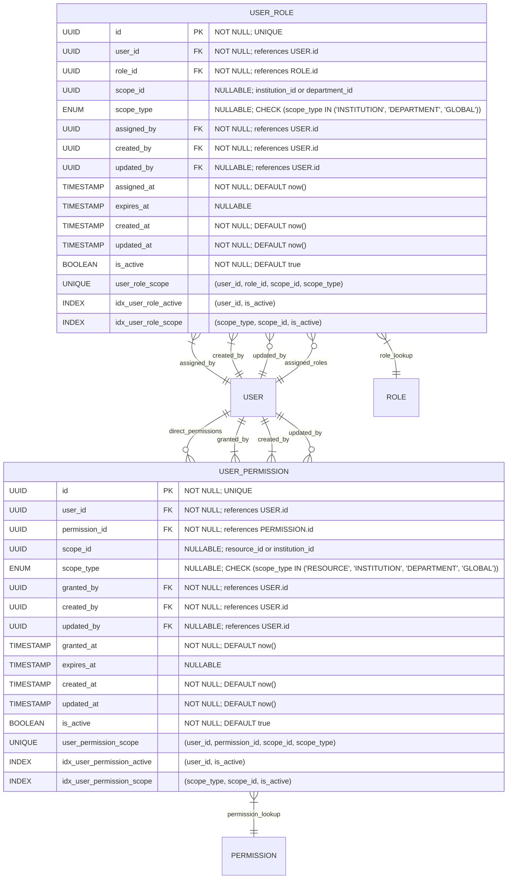

# User Roles & Permissions
**Domain:** User
**Layer:** Access Control

```mermaid
erDiagram
  USER_ROLE {
    UUID id PK                        "NOT NULL; UNIQUE"
    UUID user_id FK                   "NOT NULL; references USER.id"
    UUID role_id FK                   "NOT NULL; references ROLE.id"
    UUID scope_id                     "NULLABLE; institution_id or department_id"
    ENUM scope_type                   "NULLABLE; CHECK (scope_type IN ('INSTITUTION', 'DEPARTMENT', 'GLOBAL'))"
    UUID assigned_by FK               "NOT NULL; references USER.id"
    UUID created_by FK                "NOT NULL; references USER.id"
    UUID updated_by FK                "NULLABLE; references USER.id"
    TIMESTAMP assigned_at             "NOT NULL; DEFAULT now()"
    TIMESTAMP expires_at              "NULLABLE"
    TIMESTAMP created_at              "NOT NULL; DEFAULT now()"
    TIMESTAMP updated_at              "NOT NULL; DEFAULT now()"
    BOOLEAN is_active                 "NOT NULL; DEFAULT true"
    UNIQUE user_role_scope            "(user_id, role_id, scope_id, scope_type)"
    INDEX idx_user_role_active        "(user_id, is_active)"
    INDEX idx_user_role_scope         "(scope_type, scope_id, is_active)"
  }
  
  USER_PERMISSION {
    UUID id PK                        "NOT NULL; UNIQUE"
    UUID user_id FK                   "NOT NULL; references USER.id"
    UUID permission_id FK             "NOT NULL; references PERMISSION.id"
    UUID scope_id                     "NULLABLE; resource_id or institution_id"
    ENUM scope_type                   "NULLABLE; CHECK (scope_type IN ('RESOURCE', 'INSTITUTION', 'DEPARTMENT', 'GLOBAL'))"
    UUID granted_by FK                "NOT NULL; references USER.id"
    UUID created_by FK                "NOT NULL; references USER.id"
    UUID updated_by FK                "NULLABLE; references USER.id"
    TIMESTAMP granted_at              "NOT NULL; DEFAULT now()"
    TIMESTAMP expires_at              "NULLABLE"
    TIMESTAMP created_at              "NOT NULL; DEFAULT now()"
    TIMESTAMP updated_at              "NOT NULL; DEFAULT now()"
    BOOLEAN is_active                 "NOT NULL; DEFAULT true"
    UNIQUE user_permission_scope      "(user_id, permission_id, scope_id, scope_type)"
    INDEX idx_user_permission_active  "(user_id, is_active)"
    INDEX idx_user_permission_scope   "(scope_type, scope_id, is_active)"
  }

  USER ||--o{ USER_ROLE : "assigned_roles"
  USER ||--o{ USER_PERMISSION : "direct_permissions"
  USER_ROLE }|--|| ROLE : "role_lookup"
  USER_PERMISSION }|--|| PERMISSION : "permission_lookup"
  USER_ROLE }|--|| USER : "assigned_by"
  USER_ROLE }|--|| USER : "created_by"
  USER_ROLE }o--|| USER : "updated_by"
  USER_PERMISSION }|--|| USER : "granted_by"
  USER_PERMISSION }|--|| USER : "created_by"
  USER_PERMISSION }o--|| USER : "updated_by"
```

