# User Activity, Progress, and Ownership

**Section:** User
**Subsection:** User Activity, Progress, and Ownership

## Diagram

```mermaid
erDiagram
  %%=== Layer 3: Activity, Progress, and Ownership ===%%

  %%— Mapping & Progression Tables —
  USER_PROGRAM {
    UUID id PK               "NOT NULL"
    UUID user_id FK          "NOT NULL; references USER.id"
    UUID program_id FK       "NOT NULL; references PROGRAM.id"
    UUID assigned_by FK      "NULLABLE; references USER.id"
    TIMESTAMP assigned_at    "NOT NULL"
  }

  USER_PROGRAM_PROGRESS {
    UUID user_id FK          "NOT NULL; references USER.id"
    UUID program_id FK       "NOT NULL; references PROGRAM.id"
    INT current_day_number   "NOT NULL"
    DATE last_completed_date "NULLABLE"
    TEXT progress_notes      "NULLABLE"
    TIMESTAMP updated_at     "NOT NULL"
  }

  USER_EXERCISE_MAP {
    UUID id PK               "NOT NULL"
    UUID user_id FK          "NOT NULL; references USER.id"
    UUID exercise_id FK      "NOT NULL; references EXERCISE.id"
    TIMESTAMP mapped_at      "NOT NULL"
  }

  USER_WORKOUT_SET_MAP {
    UUID id PK               "NOT NULL"
    UUID user_id FK          "NOT NULL; references USER.id"
    UUID workout_id FK       "NOT NULL; references WORKOUT.id"
    UUID workout_set_id FK   "NOT NULL; references WORKOUT_SET.id"
    TIMESTAMP created_at     "NOT NULL; DEFAULT now()"
  }

  USER_WORKOUT_PROGRESS {
    UUID user_id FK          "NOT NULL; references USER.id"
    UUID workout_id PK       "NOT NULL; references WORKOUT.id"
    UUID completion_status   "NOT NULL; references COMPLETION_STATUS.id"
    DATE last_completed_date "NULLABLE"
    TEXT progress_notes      "NULLABLE"
    SMALLINT soreness_post_workout "NULLABLE; MIN 0, MAX 10"
    TIMESTAMP updated_at     "NOT NULL"
  }

  %%— Scheduling & Overrides —
  USER_PROGRAM_SCHEDULE_MAP {
    UUID id PK                 "NOT NULL"
    UUID user_id FK            "NOT NULL; references USER.id"
    UUID program_schedule_id FK "NOT NULL; references PROGRAM_SCHEDULE.id"
    DATE scheduled_date        "NOT NULL"
    TIMESTAMP created_at       "NOT NULL"
  }

  USER_SCHEDULE_WORKOUT_MAP {
    UUID id PK                    "NOT NULL"
    UUID user_program_schedule_id FK "NOT NULL; references USER_PROGRAM_SCHEDULE.id"
    UUID workout_id FK            "NOT NULL; references WORKOUT.id"
    SMALLINT order_index          "NOT NULL"
    BOOLEAN is_optional           "NOT NULL"
    TEXT notes                    "NULLABLE"
  }

  %%— Favorites & Activities —
  USER_FAVORITE {
    UUID user_id PK        "NOT NULL; references USER.id"
    UUID favorite_id PK    "NOT NULL; references FAVORITE.id"
    TIMESTAMP created_at   "NOT NULL; DEFAULT now()"
  }

  USER_ACTIVITY {
    UUID user_id PK        "NOT NULL; references USER.id"
    UUID activity_id PK    "NOT NULL; references ACTIVITY.id"
    TIMESTAMP created_at   "NOT NULL; DEFAULT now()"
  }

  %%— Ownership (Programs, Workouts, etc.) —
  USER_OWNERSHIP {
    UUID id PK              "NOT NULL"
    UUID user_id FK         "NOT NULL; references USER.id"
    UUID created_by FK      "NULLABLE; references USER.id"
    UUID granted_by FK      "NULLABLE; references USER.id or SYSTEM"
    UUID payment_id FK      "NULLABLE; references PAYMENT.id"
    TIMESTAMP created_at    "NOT NULL; DEFAULT now()"
    BOOLEAN is_primary_owner "NOT NULL; DEFAULT true"
    BOOLEAN can_edit        "NOT NULL; DEFAULT false"
    BOOLEAN can_delete      "NOT NULL; DEFAULT false"
    BOOLEAN is_revoked      "NOT NULL; DEFAULT false"
  }

  USER_PROGRAM_OWNERSHIP {
    UUID id PK               "NOT NULL; references USER_OWNERSHIP.id"
    UUID program_id FK       "NOT NULL; references PROGRAM.id"
    UUID program_category_id FK "NULLABLE; references PROGRAM_CATEGORY.id"
  }

  USER_WORKOUT_OWNERSHIP {
    UUID id PK               "NOT NULL; references USER_OWNERSHIP.id"
    UUID workout_id FK       "NOT NULL; references WORKOUT.id"
    UUID workout_category_id FK "NULLABLE; references WORKOUT_CATEGORY.id"
  }

  %%— Internal Relationships —
  USER ||--o{ USER_PROGRAM                  : "assigned programs"
  USER ||--o{ USER_PROGRAM_PROGRESS         : "tracks program progress"
  USER ||--o{ USER_EXERCISE_MAP             : "maps custom exercises"
  USER ||--o{ USER_WORKOUT_SET_MAP          : "maps custom sets"
  USER ||--|| USER_WORKOUT_PROGRESS         : "tracks workout progress"
  USER ||--o{ USER_PROGRAM_SCHEDULE_MAP     : "mapped schedule"
  USER_PROGRAM_SCHEDULE_MAP ||--o{ USER_SCHEDULE_WORKOUT_MAP : "workout overrides"
  USER ||--|{ USER_FAVORITE                  : "has favorites"
  USER ||--|{ USER_ACTIVITY                  : "has activities"
  USER ||--o{ USER_OWNERSHIP                 : "owns resources"
  USER_OWNERSHIP ||--|| USER_PROGRAM_OWNERSHIP : "program-specific ownership"
  USER_OWNERSHIP ||--|| USER_WORKOUT_OWNERSHIP : "workout-specific ownership"
  PROGRAM ||--o{ USER_PROGRAM_OWNERSHIP       : "can be owned"
  WORKOUT ||--o{ USER_WORKOUT_OWNERSHIP       : "can be owned"

```

## Notes

This diagram represents the user activity, progress, and ownership structure and relationships within the user domain.

---
*Generated from diagram extraction script*
