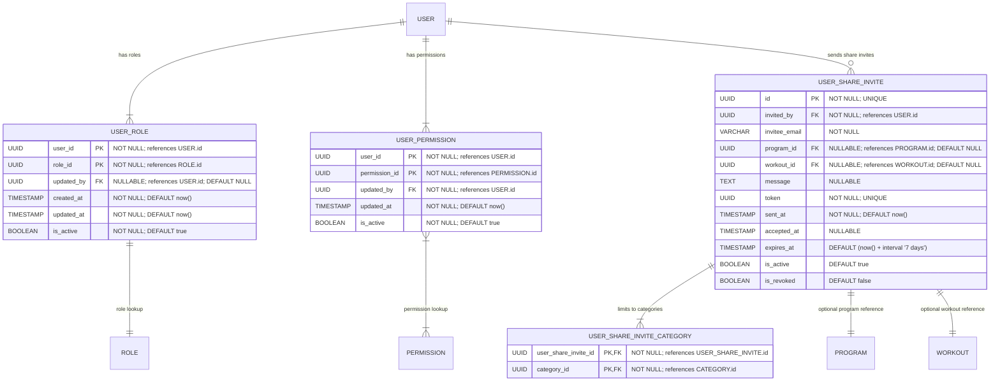

# User Roles & Permissions (Access Control)

**Section:** User
**Subsection:** User Roles & Permissions (Access Control)

## Diagram

## Notes

This diagram represents the user roles & permissions (access control) structure and relationships within the user domain.

---
*Generated from diagram extraction script*
