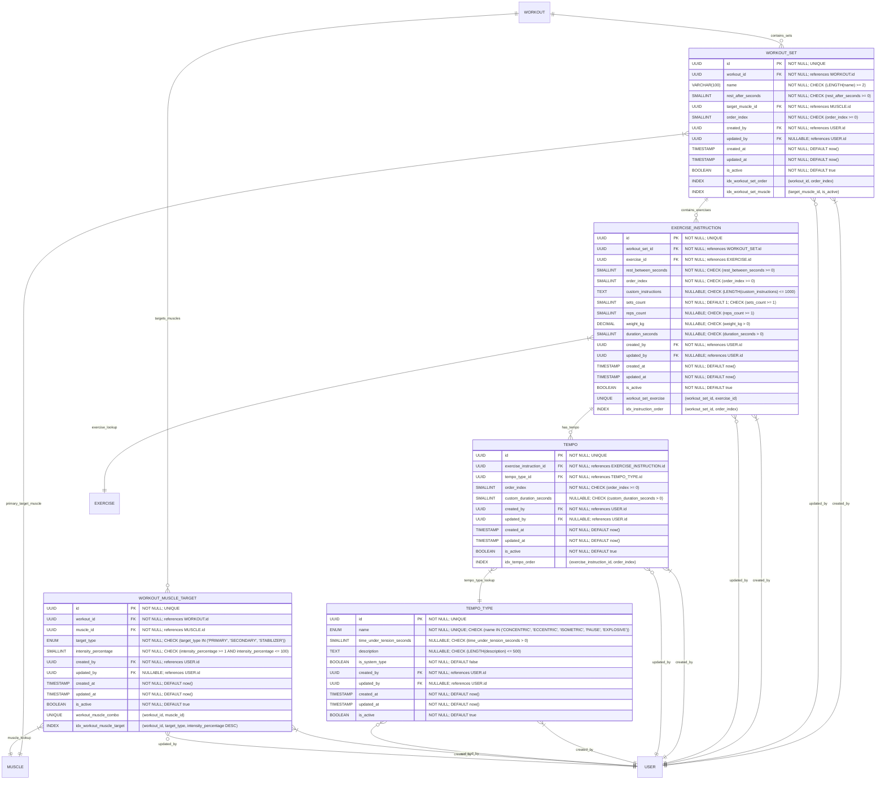

# Workout Composition - Sets & Instructions
**Domain:** Workout
**Layer:** Composition

```mermaid
erDiagram
  WORKOUT_SET {
    UUID id PK                        "NOT NULL; UNIQUE"
    UUID workout_id FK                "NOT NULL; references WORKOUT.id"
    VARCHAR(100) name                 "NOT NULL; CHECK (LENGTH(name) >= 2)"
    SMALLINT rest_after_seconds       "NOT NULL; CHECK (rest_after_seconds >= 0)"
    UUID target_muscle_id FK          "NOT NULL; references MUSCLE.id"
    SMALLINT order_index              "NOT NULL; CHECK (order_index >= 0)"
    UUID created_by FK                "NOT NULL; references USER.id"
    UUID updated_by FK                "NULLABLE; references USER.id"
    TIMESTAMP created_at              "NOT NULL; DEFAULT now()"
    TIMESTAMP updated_at              "NOT NULL; DEFAULT now()"
    BOOLEAN is_active                 "NOT NULL; DEFAULT true"
    INDEX idx_workout_set_order       "(workout_id, order_index)"
    INDEX idx_workout_set_muscle      "(target_muscle_id, is_active)"
  }
  
  EXERCISE_INSTRUCTION {
    UUID id PK                        "NOT NULL; UNIQUE"
    UUID workout_set_id FK            "NOT NULL; references WORKOUT_SET.id"
    UUID exercise_id FK               "NOT NULL; references EXERCISE.id"
    SMALLINT rest_between_seconds     "NOT NULL; CHECK (rest_between_seconds >= 0)"
    SMALLINT order_index              "NOT NULL; CHECK (order_index >= 0)"
    TEXT custom_instructions          "NULLABLE; CHECK (LENGTH(custom_instructions) <= 1000)"
    SMALLINT sets_count               "NOT NULL; DEFAULT 1; CHECK (sets_count >= 1)"
    SMALLINT reps_count               "NULLABLE; CHECK (reps_count >= 1)"
    DECIMAL weight_kg                 "NULLABLE; CHECK (weight_kg > 0)"
    SMALLINT duration_seconds         "NULLABLE; CHECK (duration_seconds > 0)"
    UUID created_by FK                "NOT NULL; references USER.id"
    UUID updated_by FK                "NULLABLE; references USER.id"
    TIMESTAMP created_at              "NOT NULL; DEFAULT now()"
    TIMESTAMP updated_at              "NOT NULL; DEFAULT now()"
    BOOLEAN is_active                 "NOT NULL; DEFAULT true"
    UNIQUE workout_set_exercise       "(workout_set_id, exercise_id)"
    INDEX idx_instruction_order       "(workout_set_id, order_index)"
  }
  
  TEMPO {
    UUID id PK                        "NOT NULL; UNIQUE"
    UUID exercise_instruction_id FK   "NOT NULL; references EXERCISE_INSTRUCTION.id"
    UUID tempo_type_id FK             "NOT NULL; references TEMPO_TYPE.id"
    SMALLINT order_index              "NOT NULL; CHECK (order_index >= 0)"
    SMALLINT custom_duration_seconds  "NULLABLE; CHECK (custom_duration_seconds > 0)"
    UUID created_by FK                "NOT NULL; references USER.id"
    UUID updated_by FK                "NULLABLE; references USER.id"
    TIMESTAMP created_at              "NOT NULL; DEFAULT now()"
    TIMESTAMP updated_at              "NOT NULL; DEFAULT now()"
    BOOLEAN is_active                 "NOT NULL; DEFAULT true"
    INDEX idx_tempo_order             "(exercise_instruction_id, order_index)"
  }
  
  TEMPO_TYPE {
    UUID id PK                        "NOT NULL; UNIQUE"
    ENUM name                         "NOT NULL; UNIQUE; CHECK (name IN ('CONCENTRIC', 'ECCENTRIC', 'ISOMETRIC', 'PAUSE', 'EXPLOSIVE'))"
    SMALLINT time_under_tension_seconds "NULLABLE; CHECK (time_under_tension_seconds > 0)"
    TEXT description                  "NULLABLE; CHECK (LENGTH(description) <= 500)"
    BOOLEAN is_system_type            "NOT NULL; DEFAULT false"
    UUID created_by FK                "NOT NULL; references USER.id"
    UUID updated_by FK                "NULLABLE; references USER.id"
    TIMESTAMP created_at              "NOT NULL; DEFAULT now()"
    TIMESTAMP updated_at              "NOT NULL; DEFAULT now()"
    BOOLEAN is_active                 "NOT NULL; DEFAULT true"
  }
  
  WORKOUT_MUSCLE_TARGET {
    UUID id PK                        "NOT NULL; UNIQUE"
    UUID workout_id FK                "NOT NULL; references WORKOUT.id"
    UUID muscle_id FK                 "NOT NULL; references MUSCLE.id"
    ENUM target_type                  "NOT NULL; CHECK (target_type IN ('PRIMARY', 'SECONDARY', 'STABILIZER'))"
    SMALLINT intensity_percentage     "NOT NULL; CHECK (intensity_percentage >= 1 AND intensity_percentage <= 100)"
    UUID created_by FK                "NOT NULL; references USER.id"
    UUID updated_by FK                "NULLABLE; references USER.id"
    TIMESTAMP created_at              "NOT NULL; DEFAULT now()"
    TIMESTAMP updated_at              "NOT NULL; DEFAULT now()"
    BOOLEAN is_active                 "NOT NULL; DEFAULT true"
    UNIQUE workout_muscle_combo       "(workout_id, muscle_id)"
    INDEX idx_workout_muscle_target   "(workout_id, target_type, intensity_percentage DESC)"
  }

  WORKOUT ||--o{ WORKOUT_SET : "contains_sets"
  WORKOUT ||--o{ WORKOUT_MUSCLE_TARGET : "targets_muscles"
  WORKOUT_SET }|--|| MUSCLE : "primary_target_muscle"
  WORKOUT_SET ||--o{ EXERCISE_INSTRUCTION : "contains_exercises"
  EXERCISE_INSTRUCTION }|--|| EXERCISE : "exercise_lookup"
  EXERCISE_INSTRUCTION ||--o{ TEMPO : "has_tempo"
  TEMPO }|--|| TEMPO_TYPE : "tempo_type_lookup"
  WORKOUT_MUSCLE_TARGET }|--|| MUSCLE : "muscle_lookup"
  WORKOUT_SET }|--|| USER : "created_by"
  WORKOUT_SET }o--|| USER : "updated_by"
  EXERCISE_INSTRUCTION }|--|| USER : "created_by"
  EXERCISE_INSTRUCTION }o--|| USER : "updated_by"
  TEMPO }|--|| USER : "created_by"
  TEMPO }o--|| USER : "updated_by"
  TEMPO_TYPE }|--|| USER : "created_by"
  TEMPO_TYPE }o--|| USER : "updated_by"
  WORKOUT_MUSCLE_TARGET }|--|| USER : "created_by"
  WORKOUT_MUSCLE_TARGET }o--|| USER : "updated_by"
```

