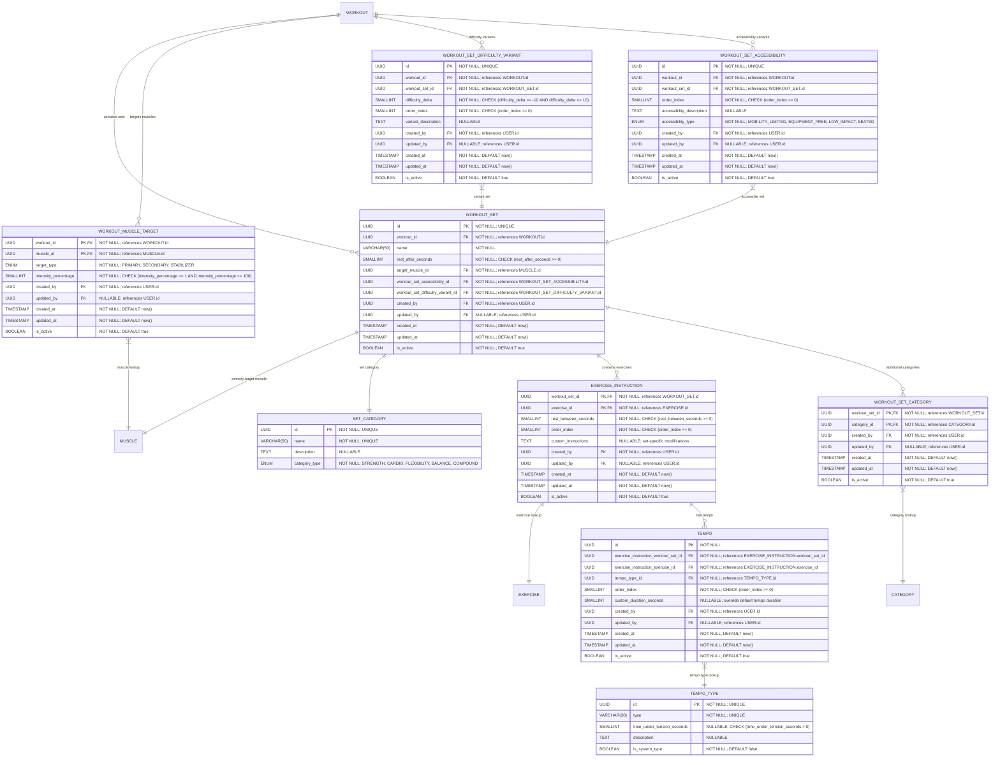

# Composition "Sets → Instructions → Tempo"
**Section:** Workout
**Subsection:** Composition "Sets → Instructions → Tempo"

## Diagram

## Notes
This diagram represents the composition "sets → instructions → tempo" structure with muscle targeting and comprehensive audit trails within the workout domain.

---
*Generated from diagram extraction script*