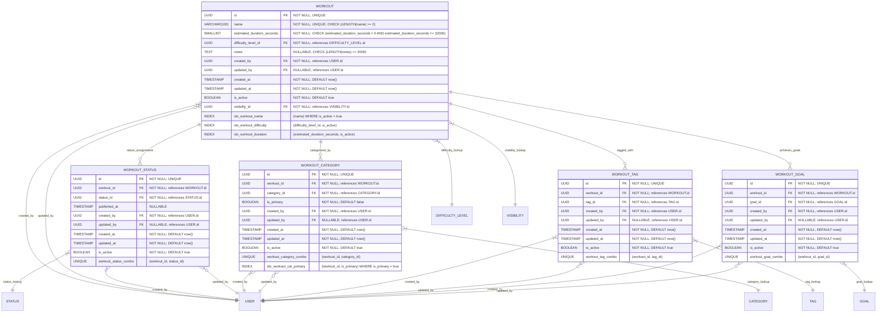

# Workout Core Definition
**Domain:** Workout
**Layer:** Core

```mermaid
erDiagram
  WORKOUT {
    UUID id PK                        "NOT NULL; UNIQUE"
    VARCHAR(100) name                 "NOT NULL; UNIQUE; CHECK (LENGTH(name) >= 2)"
    SMALLINT estimated_duration_seconds "NOT NULL; CHECK (estimated_duration_seconds > 0 AND estimated_duration_seconds <= 32000)"
    UUID difficulty_level_id FK       "NOT NULL; references DIFFICULTY_LEVEL.id"
    TEXT notes                        "NULLABLE; CHECK (LENGTH(notes) <= 2000)"
    UUID created_by FK                "NOT NULL; references USER.id"
    UUID updated_by FK                "NULLABLE; references USER.id"
    TIMESTAMP created_at              "NOT NULL; DEFAULT now()"
    TIMESTAMP updated_at              "NOT NULL; DEFAULT now()"
    BOOLEAN is_active                 "NOT NULL; DEFAULT true"
    UUID visibility_id FK             "NOT NULL; references VISIBILITY.id"
    INDEX idx_workout_name            "(name) WHERE is_active = true"
    INDEX idx_workout_difficulty      "(difficulty_level_id, is_active)"
    INDEX idx_workout_duration        "(estimated_duration_seconds, is_active)"
  }
  
  WORKOUT_STATUS {
    UUID id PK                        "NOT NULL; UNIQUE"
    UUID workout_id FK                "NOT NULL; references WORKOUT.id"
    UUID status_id FK                 "NOT NULL; references STATUS.id"
    TIMESTAMP published_at            "NULLABLE"
    UUID created_by FK                "NOT NULL; references USER.id"
    UUID updated_by FK                "NULLABLE; references USER.id"
    TIMESTAMP created_at              "NOT NULL; DEFAULT now()"
    TIMESTAMP updated_at              "NOT NULL; DEFAULT now()"
    BOOLEAN is_active                 "NOT NULL; DEFAULT true"
    UNIQUE workout_status_combo       "(workout_id, status_id)"
  }
  
  WORKOUT_CATEGORY {
    UUID id PK                        "NOT NULL; UNIQUE"
    UUID workout_id FK                "NOT NULL; references WORKOUT.id"
    UUID category_id FK               "NOT NULL; references CATEGORY.id"
    BOOLEAN is_primary                "NOT NULL; DEFAULT false"
    UUID created_by FK                "NOT NULL; references USER.id"
    UUID updated_by FK                "NULLABLE; references USER.id"
    TIMESTAMP created_at              "NOT NULL; DEFAULT now()"
    TIMESTAMP updated_at              "NOT NULL; DEFAULT now()"
    BOOLEAN is_active                 "NOT NULL; DEFAULT true"
    UNIQUE workout_category_combo     "(workout_id, category_id)"
    INDEX idx_workout_cat_primary     "(workout_id, is_primary) WHERE is_primary = true"
  }
  
  WORKOUT_TAG {
    UUID id PK                        "NOT NULL; UNIQUE"
    UUID workout_id FK                "NOT NULL; references WORKOUT.id"
    UUID tag_id FK                    "NOT NULL; references TAG.id"
    UUID created_by FK                "NOT NULL; references USER.id"
    UUID updated_by FK                "NULLABLE; references USER.id"
    TIMESTAMP created_at              "NOT NULL; DEFAULT now()"
    TIMESTAMP updated_at              "NOT NULL; DEFAULT now()"
    BOOLEAN is_active                 "NOT NULL; DEFAULT true"
    UNIQUE workout_tag_combo          "(workout_id, tag_id)"
  }
  
  WORKOUT_GOAL {
    UUID id PK                        "NOT NULL; UNIQUE"
    UUID workout_id FK                "NOT NULL; references WORKOUT.id"
    UUID goal_id FK                   "NOT NULL; references GOAL.id"
    UUID created_by FK                "NOT NULL; references USER.id"
    UUID updated_by FK                "NULLABLE; references USER.id"
    TIMESTAMP created_at              "NOT NULL; DEFAULT now()"
    TIMESTAMP updated_at              "NOT NULL; DEFAULT now()"
    BOOLEAN is_active                 "NOT NULL; DEFAULT true"
    UNIQUE workout_goal_combo         "(workout_id, goal_id)"
  }

  WORKOUT }|--|| DIFFICULTY_LEVEL : "difficulty_lookup"
  WORKOUT }|--|| VISIBILITY : "visibility_lookup"
  WORKOUT ||--o{ WORKOUT_STATUS : "status_assignments"
  WORKOUT ||--o{ WORKOUT_CATEGORY : "categorized_by"
  WORKOUT ||--o{ WORKOUT_TAG : "tagged_with"
  WORKOUT ||--o{ WORKOUT_GOAL : "achieves_goals"
  WORKOUT_STATUS }|--|| STATUS : "status_lookup"
  WORKOUT_CATEGORY }|--|| CATEGORY : "category_lookup"
  WORKOUT_TAG }|--|| TAG : "tag_lookup"
  WORKOUT_GOAL }|--|| GOAL : "goal_lookup"
  WORKOUT }|--|| USER : "created_by"
  WORKOUT }o--|| USER : "updated_by"
  WORKOUT_STATUS }|--|| USER : "created_by"
  WORKOUT_STATUS }o--|| USER : "updated_by"
  WORKOUT_CATEGORY }|--|| USER : "created_by"
  WORKOUT_CATEGORY }o--|| USER : "updated_by"
  WORKOUT_TAG }|--|| USER : "created_by"
  WORKOUT_TAG }o--|| USER : "updated_by"
  WORKOUT_GOAL }|--|| USER : "created_by"
  WORKOUT_GOAL }o--|| USER : "updated_by"
```

