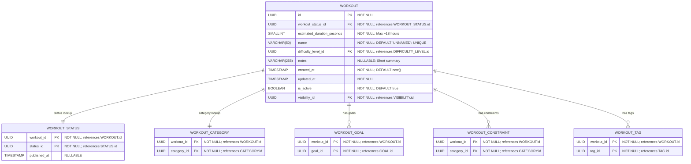

# Core “Workout” Definition & Classification

**Section:** Workout
**Subsection:** Core “Workout” Definition & Classification

## Diagram

## Notes

This diagram represents the core “workout” definition & classification structure and relationships within the workout domain.

---
*Generated from diagram extraction script*
