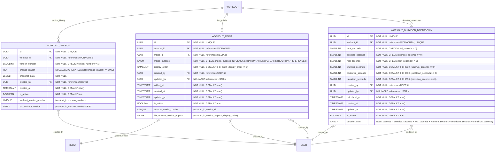

# Workout Extensions & Media
**Domain:** Workout
**Layer:** Extensions

```mermaid
erDiagram
  WORKOUT_VERSION {
    UUID id PK                        "NOT NULL; UNIQUE"
    UUID workout_id FK                "NOT NULL; references WORKOUT.id"
    SMALLINT version_number           "NOT NULL; CHECK (version_number >= 1)"
    TEXT change_reason                "NULLABLE; CHECK (LENGTH(change_reason) <= 1000)"
    JSONB snapshot_data               "NOT NULL"
    UUID created_by FK                "NOT NULL; references USER.id"
    TIMESTAMP created_at              "NOT NULL; DEFAULT now()"
    BOOLEAN is_active                 "NOT NULL; DEFAULT true"
    UNIQUE workout_version_number     "(workout_id, version_number)"
    INDEX idx_workout_version         "(workout_id, version_number DESC)"
  }
  
  WORKOUT_MEDIA {
    UUID id PK                        "NOT NULL; UNIQUE"
    UUID workout_id FK                "NOT NULL; references WORKOUT.id"
    UUID media_id FK                  "NOT NULL; references MEDIA.id"
    ENUM media_purpose                "NOT NULL; CHECK (media_purpose IN ('DEMONSTRATION', 'THUMBNAIL', 'INSTRUCTION', 'REFERENCE'))"
    SMALLINT display_order            "NOT NULL; DEFAULT 0; CHECK (display_order >= 0)"
    UUID created_by FK                "NOT NULL; references USER.id"
    UUID updated_by FK                "NULLABLE; references USER.id"
    TIMESTAMP added_at                "NOT NULL; DEFAULT now()"
    TIMESTAMP created_at              "NOT NULL; DEFAULT now()"
    TIMESTAMP updated_at              "NOT NULL; DEFAULT now()"
    BOOLEAN is_active                 "NOT NULL; DEFAULT true"
    UNIQUE workout_media_combo        "(workout_id, media_id)"
    INDEX idx_workout_media_purpose   "(workout_id, media_purpose, display_order)"
  }
  
  WORKOUT_DURATION_BREAKDOWN {
    UUID id PK                        "NOT NULL; UNIQUE"
    UUID workout_id FK                "NOT NULL; references WORKOUT.id; UNIQUE"
    SMALLINT total_seconds            "NOT NULL; CHECK (total_seconds > 0)"
    SMALLINT exercise_seconds         "NOT NULL; CHECK (exercise_seconds >= 0)"
    SMALLINT rest_seconds             "NOT NULL; CHECK (rest_seconds >= 0)"
    SMALLINT warmup_seconds           "NOT NULL; DEFAULT 0; CHECK (warmup_seconds >= 0)"
    SMALLINT cooldown_seconds         "NOT NULL; DEFAULT 0; CHECK (cooldown_seconds >= 0)"
    SMALLINT transition_seconds       "NOT NULL; DEFAULT 0; CHECK (transition_seconds >= 0)"
    UUID created_by FK                "NOT NULL; references USER.id"
    UUID updated_by FK                "NULLABLE; references USER.id"
    TIMESTAMP calculated_at           "NOT NULL; DEFAULT now()"
    TIMESTAMP created_at              "NOT NULL; DEFAULT now()"
    TIMESTAMP updated_at              "NOT NULL; DEFAULT now()"
    BOOLEAN is_active                 "NOT NULL; DEFAULT true"
    CHECK duration_sum                "(total_seconds = exercise_seconds + rest_seconds + warmup_seconds + cooldown_seconds + transition_seconds)"
  }

  WORKOUT ||--o{ WORKOUT_VERSION : "version_history"
  WORKOUT ||--o{ WORKOUT_MEDIA : "has_media"
  WORKOUT ||--o{ WORKOUT_DURATION_BREAKDOWN : "duration_breakdown"
  WORKOUT_MEDIA }|--|| MEDIA : "media_lookup"
  WORKOUT_VERSION }|--|| USER : "created_by"
  WORKOUT_MEDIA }|--|| USER : "created_by"
  WORKOUT_MEDIA }o--|| USER : "updated_by"
  WORKOUT_DURATION_BREAKDOWN }|--|| USER : "created_by"
  WORKOUT_DURATION_BREAKDOWN }o--|| USER : "updated_by"
```

