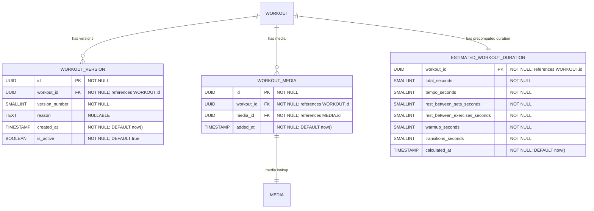

# Metadata & Extensions (Versions, Media, Duration)

**Section:** Workout
**Subsection:** Metadata & Extensions (Versions, Media, Duration)

## Diagram

## Notes

This diagram represents the metadata & extensions (versions, media, duration) structure and relationships within the workout domain.

---
*Generated from diagram extraction script*
